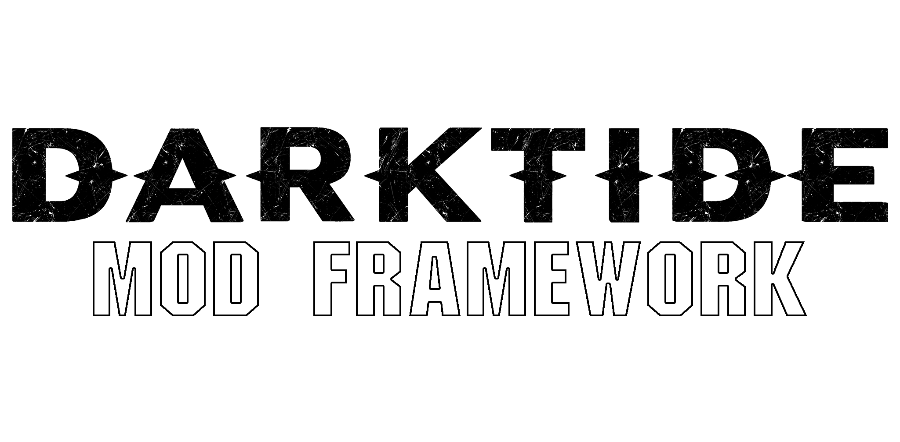

  <picture>
    <source media="(prefers-color-scheme: dark)" srcset="./assets/dmf_logo_white.png">
    <source media="(prefers-color-scheme: light)" srcset="./assets/dmf_logo_black.png">
    
  </picture>

## Welcome to the Darktide Mod Framework (DMF) Repository!

The Darktide Mod Framework is an open-source, community-run framework of modules that provides enhanced modding capabilities and support. The framework is designed to be both independent and lightweight; making no changes to gameplay on its own.

Mods created for the project may utilize:

* Mod options
* Shared function hooks
* Chat commands
* Keybinds
* Rewritten, lightweight mod functions
* An on-event call system

The Darktide Mod Framework is a fork of the Vermintide Mod Framework that originally started in Warhammer End Times: Vermintide as an unofficial modding platform. In the time since, the framework has been rewritten and redesigned with contributions from many unique members of the community; culminating in this unified project.

For more information, check out **[the framework's wiki pages](http://dmf-docs.darkti.de)**.
